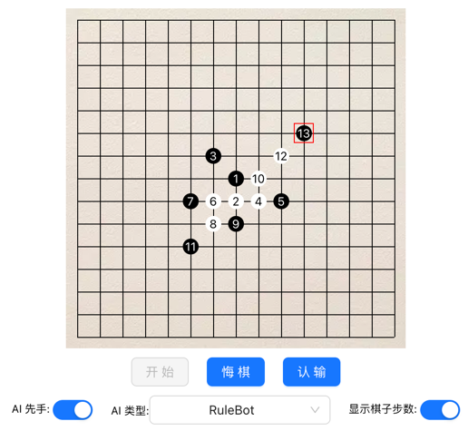

<div id="top"></div>
# 五子棋前后端集成示例

✨ 这是一个五子棋游戏的前后端集成方案，其中[前端界面](https://github.com/lihongxun945/gobang)基于 React 构建，提供了与用户的交互界面；
后端服务使用Flask框架搭建，基于 [LightZero](https://github.com/opendilab/LightZero) 实现了五子棋的 AI（包括基于规则的 Bot 和预训练好的 AlphaZero Agent）。

## 快速上手

本指南将帮助您快速部署和启动五子棋游戏的前端和后端服务。

### 前端安装与运行

首先，您需要从GitHub上克隆前端项目代码：

```bash
git clone https://github.com/puyuan1996/gomoku_server_ui.git
cd gomoku/frontend
npm install
npm run start # 或者 npm run debug 以启动调试模式
```

上面的命令会安装所有前端依赖，并启动前端开发服务器。

✨注意，与参考的 Gomoku [前端项目](https://github.com/lihongxun945/gobang) 相比，主要更改如下：

- 为了与后端服务器进行交互，增加了与后端交互的代码，主要更改位于：
  - `src/components/board.js` 的 `handleClick` 函数。
  - `src/components/control.js` 的 `return` 渲染界面部分。
  - `src/minimax.worker.js` 的 `start` 和 `move` 函数。
- 为 React 相关的前端核心文件增加了整体功能和结构概述，以及逐行注释。

### 后端安装与运行

在您的系统中安装好Python环境之后，按照以下步骤配置和运行后端服务：

```bash
cd gomoku/backend
pip3 install -e .
# 将miniconda环境路径添加到系统PATH变量中，确保能使用该环境下的Python及其库
export PATH="/Users/puyuan/miniconda3/envs/arm64-py38/bin:$PATH"
# 设置Flask应用的环境变量并启动Flask应用
FLASK_APP=app.py FLASK_ENV=development FLASK_DEBUG=1 flask run --port 5001
```

上面的命令将设置必要的环境变量，然后启动Flask服务器。

### 与 AI 对战

✨在前端渲染得到的界面上，一般网址为 http://localhost:3000/。
您可以选择与不同的 AI 对战，具体界面如下所示：



- [AI 类型] 选择 `AlphaZero` 就是与基于 [LightZero](https://github.com/opendilab/LightZero) 预训练好的 AlphaZero Agent 对战。
- [AI 类型] 选择 `RuleBot` 就是与 [LightZero](https://github.com/opendilab/LightZero) 中基于规则的 Bot, 或者训练好的 AlphaZero Agent) 对战。
- [AI 类型] 选择 `Random` 就是与随机 Agent 对战。
- [AI 类型] 选择 `AB-2, AB-4` 表示直接与[前端AI](https://github.com/lihongxun945/gobang) 中的 Alpha-Beta 减枝算法对战，其中 AB-x 中的 x 表示不同的搜索深度，也即不同的水平。

## 致谢

- 🎉在这个五子棋项目中，前端部分是在[lihongxun945/gobang](https://github.com/lihongxun945/gobang)项目上进行了微调，感谢原作者提供的优秀代码作为参考。如果您对五子棋前端AI感兴趣，您可以访问原项目以了解更多详情。
- 🎉后端 AI 部分基于 [LightZero](https://github.com/opendilab/LightZero) 实现，如果你对 MCTS+RL 算法感兴趣，欢迎访问原项目。

<p align="right">(<a href="#top">回到顶部</a>)</p>